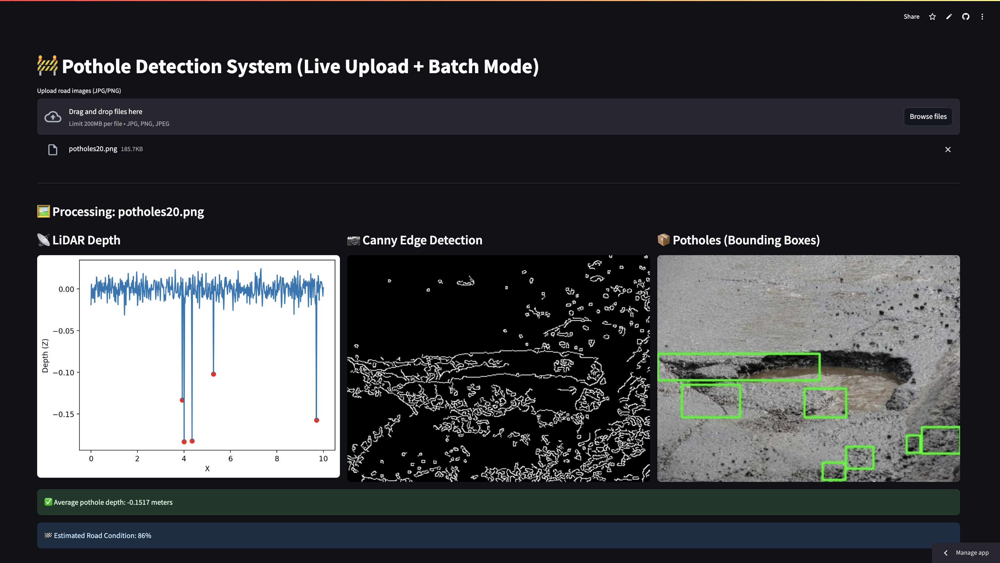

# 🚧 Simulated Pothole Detection System Using LiDAR & Camera Sensor Fusion

A real-time, AI-powered web app that detects potholes using simulated LiDAR depth data and road image analysis. Deployed on Streamlit Cloud, it allows users to upload images, visualize pothole detection, and analyze road quality.

🔗 **Live App**: [Click here to try it](https://pothole-detection-ai-gsh5qkjabjtl8dcesws2ug.streamlit.app/)

📸 **Screenshot**:  


---

## 💡 Features

- ✅ Simulated LiDAR data generator
- ✅ Real-time image edge detection and pothole localization
- ✅ Bounding box visualization using OpenCV
- ✅ Average pothole depth estimation
- ✅ Road condition scoring (based on pothole area)
- ✅ Image upload (live testing)
- ✅ Multiple image support
- ✅ Streamlit Cloud deployment

---

## 📦 Tech Stack

- Python 3
- Streamlit
- OpenCV (cv2)
- NumPy, Pandas
- Matplotlib
- PIL (Pillow)

---

## 🚀 How to Run Locally

1. Clone the repo:

```bash
git clone https://github.com/KrishnanshVasaniya/pothole-detection-ai.git
cd pothole-detection-ai
```
